# La Concepcion College Digital Gate Pass Management System

A Research Project Presented to the Faculty of Senior High School Division La Concepcion College Inc.

In Partial Fulfillment of the Requirements for the Subject Research Project of Information and Communication Technology (ICT).

### Project Context
The LCC Digital Gate Pass and Visitors Management System aims to replace outdated processes of logging with an automated, secure, and user-friendly digital solution. By integrating RFID + QR based passes, digital visitor registration, automated approval workflows, and real-time monitoring dashboards, the system enhances security while improving the overall efficiency of campus entry management.

# Preview

### Admin Dashboard

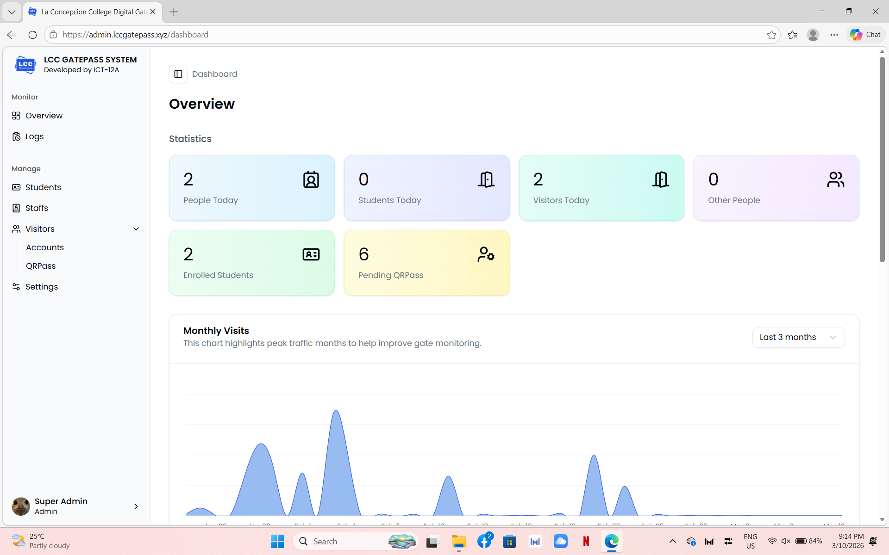  
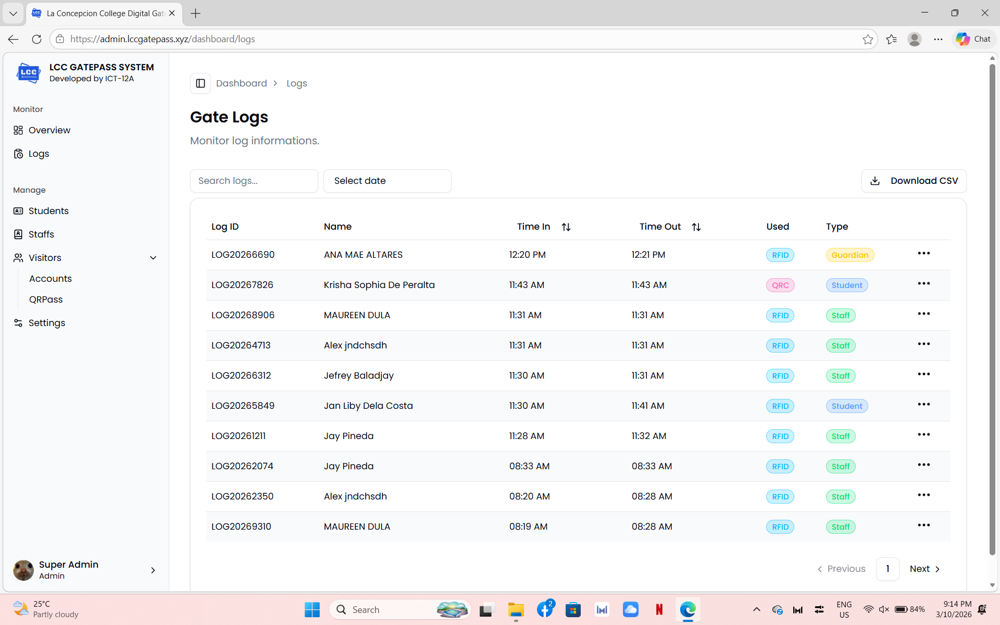  
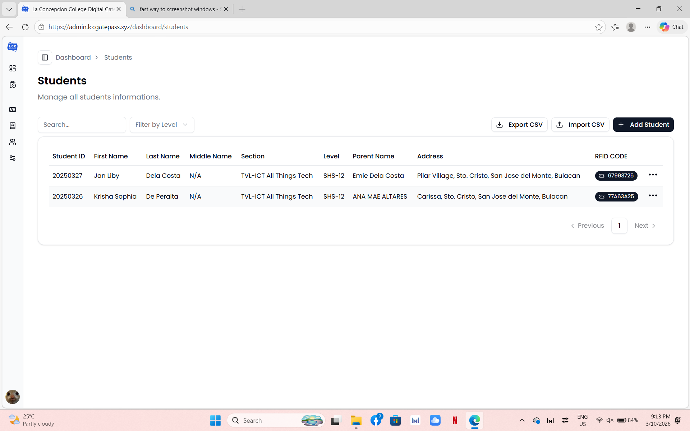  
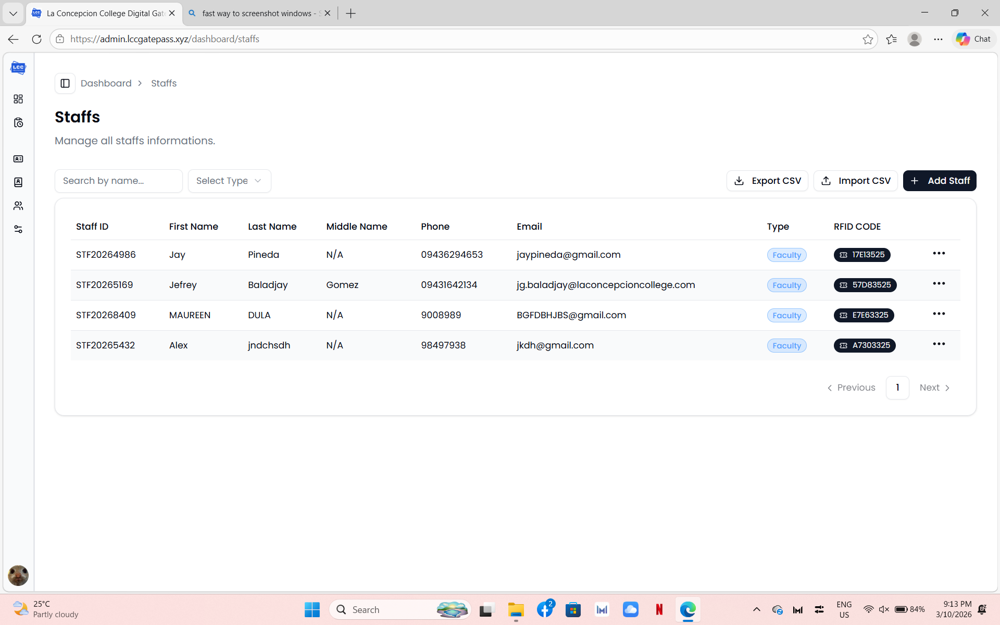  
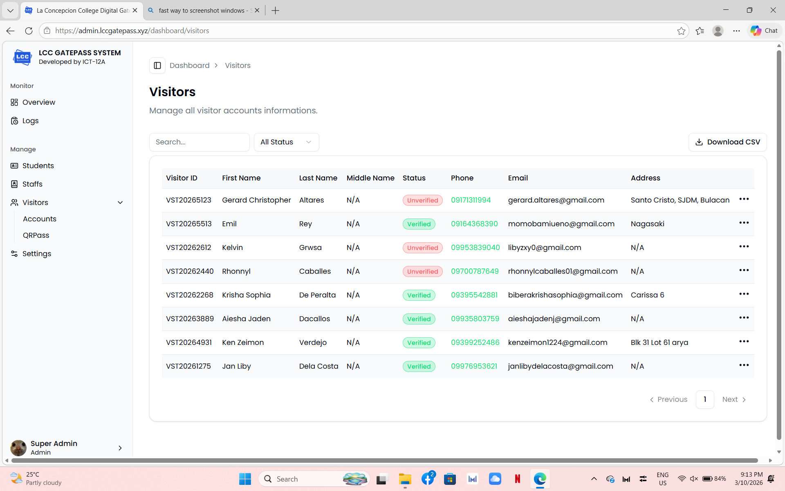  
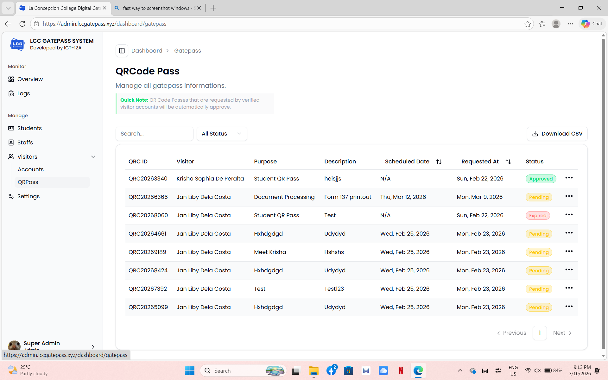  
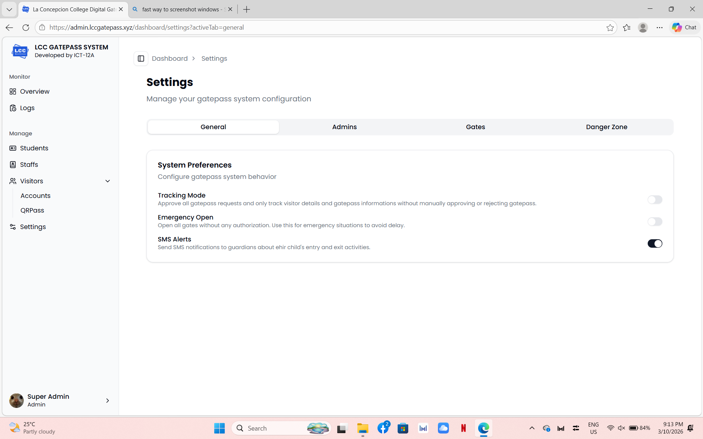  

### Mobile App

| 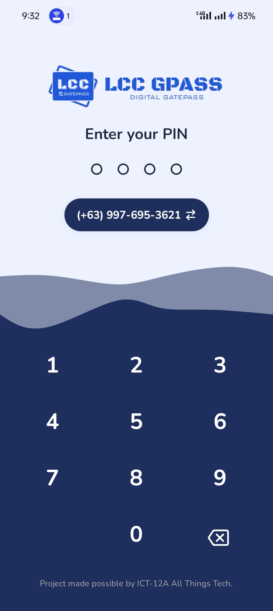 | 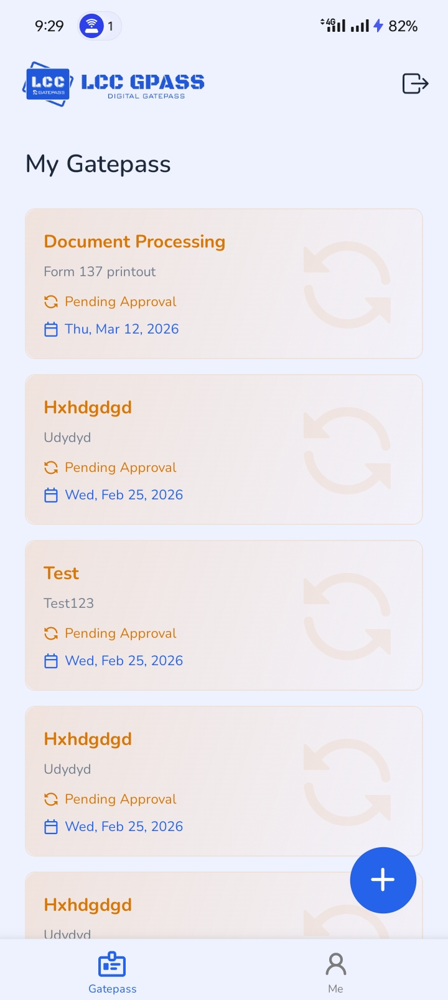 | 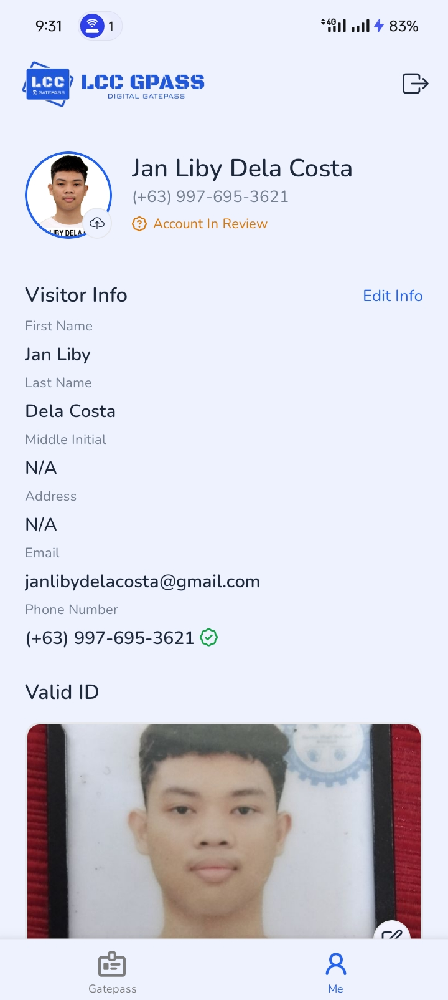 |
|-------------------------------------|-------------------------------------|-------------------------------------|
| 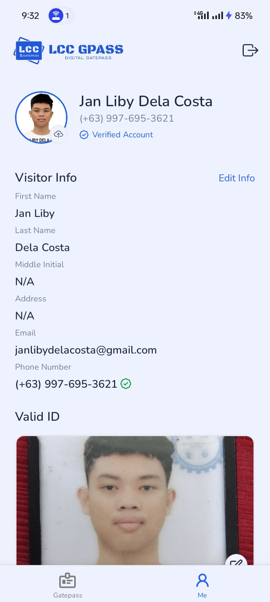 | 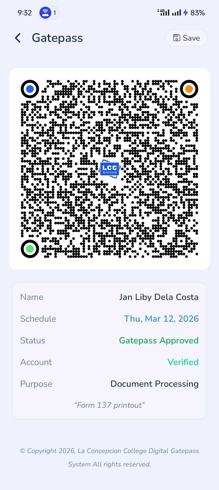 | 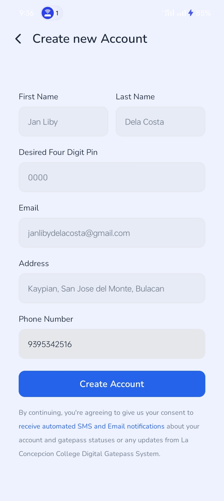 |

### Turnstile Gate

|  |  |  |
|---|---|---|
| 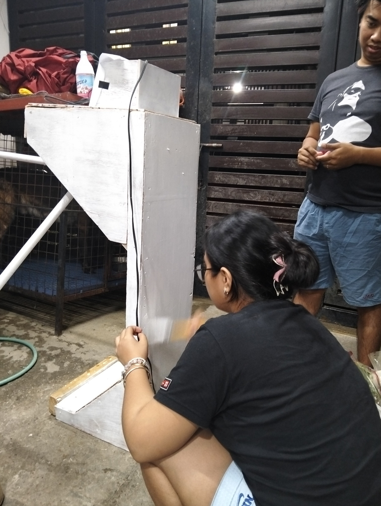 | 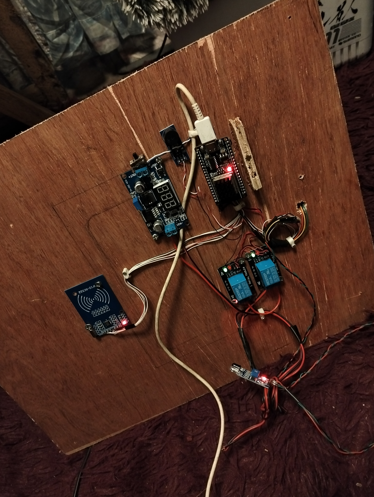 | [Watch Demo Video](docu-assets/short_demo_vid.mp4) |

# Members
- Banting, Prince Andrei P.
- Dacallos, Aiesha Jaden J.
- Dela Costa, Jan Liby (Programmer)
- De Peralta, Krisha Sophia B. (Leader)
- Grasa, Kelvin John C.
- Indic, Rose Marie

